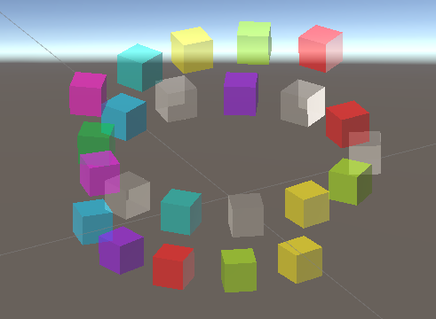

---

# Demographic Questionnaire

[demographic](demographic.docx)

1. What is your gender?

    A. Female
    B. Male
    C. Other
    D. Prefer not to say

2. What is your age group ?

    A. 18-24
    B. 25-34
    C. 35-44
    D. 45-54
    E. 55 and above

3. What music instruments do you play:______________________
for (how long)___________?

4. What is your dominant hand? If you normally use your non-dominant hand to play instruments, please provide details in the blank below (e.g. left-handed guitar).

    A. Left hand
    B. Right hand
    C. Prefer not to say

5. Do you have any previous experiences using mixed reality headsets such as VR headset Oculus, or Microsoft HoloLens for performing music related activities? Such as video game Beat Saber or Smash Drums in Oculus?

     

    <figure>
    
     <figcaption>Smash Drums<figcaption>
     <source>https://uploadvr.com/wp-content/uploads/2020/07/smash-drums-vr.png</source>
    </figure>
    
    <figure>
    
     <figcaption>Beat Saber<figcaption>
     <source>https://c.tenor.com/aTCIDji_4iEAAAAd/wide-lens-beat-saber-vrhere.gif</source>
    </figure>

---

# Survey Questionnaire

[questionnaire](questionnaire.docx)

## 1. Feature controllability and Usability:

- I feel in control of the instrument.
- I can play precisely on the instrument.
- The instrument does what I want it to do.
- I can control the sound appropriately.
- I found the instrument was easy to use.
- I found the instrument responds well to my actions.

## 2. Learnability:

- It didn't took me much efforts to complete the task.

- It didn't took me much efforts to learn how to complete the task.

- I found easy to replicate simple musical gestures while prompting the task.

- This instrument allows me to learn new things.

## 3. Explorability:

- To play a same note, chord, patterns or musical phrases, I found I could use different hand gestures.

- During these tasks, I can continually discover new things by using this instrument.

- Overall, I found different opportunities of using hand gestures to play different musical patterns.

## 4. Enjoyment:

- I enjoyed myself during the experience of using hand gestures to engage with this new musical interface.

- I enjoyed the overall experience of interacting with this new musical interface.

- The instrument please me sound-wise.

- I found the instrument aesthetically pleasing.

# Interview Questions

[interview](interview.docx)

1.	How was your overall experience?

2.	How do you feel about using hand gestures to play music through this interface?
a.	 interaction-wise
b.	 sound-wise
c.	any other perspectives as a novel digital musical instrument
3.	What impresses you the most? 

4.	Any downsides/suggestions regarding the design of this new musical interface for music creativity?

---
# Music Sheet

## General Information

The interface is composed of three layers: bottom, middle and top.

Each cube represents a music note of FM synth, following a traditional keyboard layout.

In the middle layer, starting from the **pink** cube as C4, in the anti-clockwise direction, following C4#, D4, D4#, etc. This changes the modulation frequency.

While the upper and lower layers provide notes which changes the carrier frequency.

As shown in the second picture, you can use you fingers to trigger this notes to play.

For task 2 and 3, you will be asked to follow color patterns with text info to complete designed tasks.

## Task 2

Play 5 chords or music patterns:

--------------------> time

- Pattern 1: 

    __ C

    __ E

    __ G

- Pattern 2:

    __ B

    __ A

    __ F

- Pattern 3:

    __  C4#

    __ A

- Pattern 4:

    __ A

    __ C5

- Pattern 5:

    __ F

    __ G

## Task 3

Each block represents a tempo, "_" means dotted quarter notes following what stands before it.

Phrase 1 :

--------------------> time

__ G
__ G
__ 
__ 
|
__ G
__ A
__ 
__ 
|
__ G
__ B
__ 
__ 
|
__ G
__ 
__ 
__ 

Phrase 2 :

--------------------> time

__ C4
 __  
 __  
 __  
|
__ A-bt
 __  
 __  
 __  
|
__ A-bt
 __  
 __  
 __  
|
__ F
 _  
 _  
 _  
|

__ B-bt
 __  
 __  
 __  
|
 __  
 __  
 __  
 __  
|
__ B-bt
|
 __  
 __  
 __  
 __  
|

